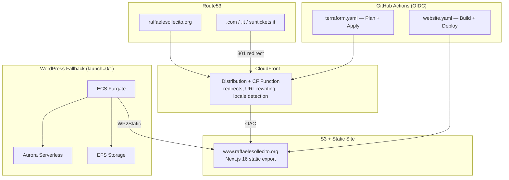

# raffaelesollecito.org

[](https://github.com/Raffasolaries/raffaelesollecito.org/actions/workflows/website.yaml)
[](https://github.com/Raffasolaries/raffaelesollecito.org/actions/workflows/terraform.yaml)
[](https://github.com/Raffasolaries/raffaelesollecito.org/actions/workflows/testsuite.yaml)

Personal website and AWS infrastructure for [raffaelesollecito.org](https://raffaelesollecito.org) — a bilingual (EN/IT) portfolio, memoir, and legal archive.

## Architecture



## Tech Stack

| Component | Technology |
|-----------|-----------|
| **Website** | Next.js 16, React 19, TypeScript 5, Tailwind CSS 4, next-intl |
| **Infrastructure** | Terraform >= 1.14, AWS Provider ~> 6.0 |
| **Hosting** | S3 + CloudFront (OAC) + CloudFront Function |
| **DNS** | Route53 (4 hosted zones) + ACM (multi-domain cert) |
| **CI/CD** | GitHub Actions with AWS OIDC |
| **CMS Fallback** | WordPress on ECS Fargate + Aurora Serverless |

## Website

Bilingual (EN/IT) static site with dark/light mode, deployed to S3 via GitHub Actions.

**Pages**: Home, About, Experience, Projects, Family, Book, The Case, Documents, Contact, Archive

```bash
cd website
npm install
npm run dev     # Dev server on localhost:3000
npm run build   # Static export to out/
```

## Domains

| Domain | Destination |
|--------|-------------|
| `raffaelesollecito.org` | Primary website |
| `www.raffaelesollecito.org` | 301 redirect |
| `raffaelesollecito.com` (+www) | 301 redirect |
| `raffaelesollecito.it` (+www) | 301 redirect |
| `suntickets.it` (+www) | 301 to /archive/ (locale-aware) |

## Infrastructure

```bash
cp local.tfvars.example local.tfvars
AWS_PROFILE=iamadmin terraform init
AWS_PROFILE=iamadmin terraform plan -var-file=local.tfvars
AWS_PROFILE=iamadmin terraform apply -var-file=local.tfvars
```

## CI/CD

| Workflow | Trigger | Purpose |
|----------|---------|---------|
| `website.yaml` | Push to main (website/**) | Build Next.js, deploy to S3, invalidate CloudFront |
| `terraform.yaml` | Push to main / PRs | Terraform plan on PRs, apply on merge |
| `testsuite.yaml` | PRs | pre-commit, tflint, tfsec, misspell, yamllint |

## Documentation

- [Architecture](docs/architecture.md) — Infrastructure diagrams and component details
- [Website](docs/website.md) — Next.js frontend, i18n, SEO, images
- [Deployment](docs/deployment.md) — CI/CD pipelines, manual deploy, rollback
- [Domains](docs/domains.md) — Domain inventory, redirect logic, adding new domains

## Credits

Infrastructure originally based on [terraform-aws-serverless-static-wordpress](https://github.com/TechToSpeech/terraform-aws-serverless-static-wordpress) by TechToSpeech.
