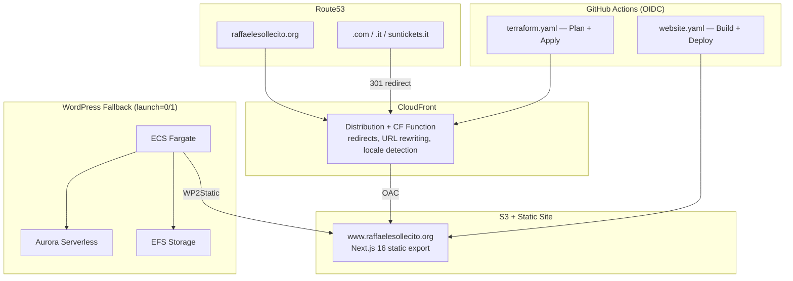

<!-- BEGIN_TF_DOCS -->
# raffaelesollecito.org

[](https://github.com/Raffasolaries/raffaelesollecito.org/actions/workflows/website.yaml)
[](https://github.com/Raffasolaries/raffaelesollecito.org/actions/workflows/terraform.yaml)
[](https://github.com/Raffasolaries/raffaelesollecito.org/actions/workflows/testsuite.yaml)

Personal website and AWS infrastructure for [raffaelesollecito.org](https://raffaelesollecito.org) — a bilingual (EN/IT) portfolio, memoir, and legal archive.

## Architecture



## Tech Stack

| Component | Technology |
|-----------|-----------|
| **Website** | Next.js 16, React 19, TypeScript 5, Tailwind CSS 4, next-intl |
| **Infrastructure** | Terraform >= 1.14, AWS Provider ~> 6.0 |
| **Hosting** | S3 + CloudFront (OAC) + CloudFront Function |
| **DNS** | Route53 (4 hosted zones) + ACM (multi-domain cert) |
| **CI/CD** | GitHub Actions with AWS OIDC |
| **CMS Fallback** | WordPress on ECS Fargate + Aurora Serverless |

## Website

Bilingual (EN/IT) static site with dark/light mode, deployed to S3 via GitHub Actions.

**Pages**: Home, About, Experience, Projects, Family, Book, The Case, Documents, Contact, Archive

```bash
cd website
npm install
npm run dev     # Dev server on localhost:3000
npm run build   # Static export to out/
```

## Domains

| Domain | Destination |
|--------|-------------|
| `raffaelesollecito.org` | Primary website |
| `www.raffaelesollecito.org` | 301 redirect |
| `raffaelesollecito.com` (+www) | 301 redirect |
| `raffaelesollecito.it` (+www) | 301 redirect |
| `suntickets.it` (+www) | 301 to /archive/ (locale-aware) |

## Infrastructure

```bash
cp local.tfvars.example local.tfvars
AWS_PROFILE=iamadmin terraform init
AWS_PROFILE=iamadmin terraform plan -var-file=local.tfvars
AWS_PROFILE=iamadmin terraform apply -var-file=local.tfvars
```

## CI/CD

| Workflow | Trigger | Purpose |
|----------|---------|---------|
| `website.yaml` | Push to main (website/**) | Build Next.js, deploy to S3, invalidate CloudFront |
| `terraform.yaml` | Push to main / PRs | Terraform plan on PRs, apply on merge |
| `testsuite.yaml` | PRs | pre-commit, tflint, tfsec, misspell, yamllint |

## Documentation

- [Architecture](docs/architecture.md) — Infrastructure diagrams and component details
- [Website](docs/website.md) — Next.js frontend, i18n, SEO, images
- [Deployment](docs/deployment.md) — CI/CD pipelines, manual deploy, rollback
- [Domains](docs/domains.md) — Domain inventory, redirect logic, adding new domains

## Credits

Infrastructure originally based on [terraform-aws-serverless-static-wordpress](https://github.com/TechToSpeech/terraform-aws-serverless-static-wordpress) by TechToSpeech.

## Inputs

| Name | Description | Type | Default | Required |
|------|-------------|------|---------|:--------:|
| <a name="input_aws_account_id"></a> [aws\_account\_id](#input\_aws\_account\_id) | The AWS account ID into which resources will be launched. | `string` | n/a | yes |
| <a name="input_cloudfront_aliases"></a> [cloudfront\_aliases](#input\_cloudfront\_aliases) | The domain and sub-domain aliases to use for the CloudFront distribution. | `list(string)` | `[]` | no |
| <a name="input_cloudfront_class"></a> [cloudfront\_class](#input\_cloudfront\_class) | The price class for the distribution. One of: PriceClass\_All, PriceClass\_200, PriceClass\_100. | `string` | `"PriceClass_All"` | no |
| <a name="input_ecs_cpu"></a> [ecs\_cpu](#input\_ecs\_cpu) | CPU units for the Wordpress container definition. | `number` | `256` | no |
| <a name="input_ecs_memory"></a> [ecs\_memory](#input\_ecs\_memory) | Memory (MB) for the Wordpress container definition. | `number` | `512` | no |
| <a name="input_hosted_zone_id"></a> [hosted\_zone\_id](#input\_hosted\_zone\_id) | The Route53 HostedZone ID to use to create records in. | `string` | n/a | yes |
| <a name="input_launch"></a> [launch](#input\_launch) | Number of Wordpress tasks to launch (0 or 1). Toggle to start/stop the management session. | `number` | `0` | no |
| <a name="input_main_vpc_id"></a> [main\_vpc\_id](#input\_main\_vpc\_id) | The VPC ID into which to launch resources. | `string` | n/a | yes |
| <a name="input_redirect_domains"></a> [redirect\_domains](#input\_redirect\_domains) | Map of domains that should redirect to the main site. Key is the domain, value contains the hosted zone ID and the target URL path. | <pre>map(object({<br/>    zone_id     = string<br/>    redirect_to = string<br/>  }))</pre> | `{}` | no |
| <a name="input_s3_region"></a> [s3\_region](#input\_s3\_region) | The regional endpoint to use for the S3 bucket for the published static site. | `string` | n/a | yes |
| <a name="input_site_domain"></a> [site\_domain](#input\_site\_domain) | The site domain name to configure (without any subdomains such as 'www'). | `string` | n/a | yes |
| <a name="input_site_name"></a> [site\_name](#input\_site\_name) | The unique name for this instance of the module. | `string` | n/a | yes |
| <a name="input_site_prefix"></a> [site\_prefix](#input\_site\_prefix) | The subdomain prefix of the website domain. | `string` | `"www"` | no |
| <a name="input_slack_webhook"></a> [slack\_webhook](#input\_slack\_webhook) | The Slack webhook URL where ECS EventBridge notifications will be sent. | `string` | `""` | no |
| <a name="input_snapshot_identifier"></a> [snapshot\_identifier](#input\_snapshot\_identifier) | To create the RDS cluster from a previous snapshot, specify it by name. | `string` | `null` | no |
| <a name="input_subnet_ids"></a> [subnet\_ids](#input\_subnet\_ids) | A list of subnet IDs within the specified VPC where resources will be launched. | `list(string)` | n/a | yes |
| <a name="input_waf_acl_rules"></a> [waf\_acl\_rules](#input\_waf\_acl\_rules) | List of WAF rules to apply. | <pre>list(object({<br/>    name                       = string<br/>    priority                   = number<br/>    managed_rule_group_name    = string<br/>    vendor_name                = string<br/>    cloudwatch_metrics_enabled = bool<br/>    metric_name                = string<br/>    sampled_requests_enabled   = bool<br/>  }))</pre> | <pre>[<br/>  {<br/>    "cloudwatch_metrics_enabled": true,<br/>    "managed_rule_group_name": "AWSManagedRulesAmazonIpReputationList",<br/>    "metric_name": "AWS-AWSManagedRulesAmazonIpReputationList",<br/>    "name": "AWS-AWSManagedRulesAmazonIpReputationList",<br/>    "priority": 0,<br/>    "sampled_requests_enabled": true,<br/>    "vendor_name": "AWS"<br/>  },<br/>  {<br/>    "cloudwatch_metrics_enabled": true,<br/>    "managed_rule_group_name": "AWSManagedRulesKnownBadInputsRuleSet",<br/>    "metric_name": "AWS-AWSManagedRulesKnownBadInputsRuleSet",<br/>    "name": "AWS-AWSManagedRulesKnownBadInputsRuleSet",<br/>    "priority": 1,<br/>    "sampled_requests_enabled": true,<br/>    "vendor_name": "AWS"<br/>  },<br/>  {<br/>    "cloudwatch_metrics_enabled": true,<br/>    "managed_rule_group_name": "AWSManagedRulesBotControlRuleSet",<br/>    "metric_name": "AWS-AWSManagedRulesBotControlRuleSet",<br/>    "name": "AWS-AWSManagedRulesBotControlRuleSet",<br/>    "priority": 2,<br/>    "sampled_requests_enabled": true,<br/>    "vendor_name": "AWS"<br/>  }<br/>]</pre> | no |
| <a name="input_waf_enabled"></a> [waf\_enabled](#input\_waf\_enabled) | Flag to enable default WAF configuration in front of CloudFront. | `bool` | `false` | no |
| <a name="input_wordpress_admin_email"></a> [wordpress\_admin\_email](#input\_wordpress\_admin\_email) | The email address of the default Wordpress admin user. | `string` | `"admin@example.com"` | no |
| <a name="input_wordpress_admin_password"></a> [wordpress\_admin\_password](#input\_wordpress\_admin\_password) | The password of the default Wordpress admin user. | `string` | `""` | no |
| <a name="input_wordpress_admin_user"></a> [wordpress\_admin\_user](#input\_wordpress\_admin\_user) | The username of the default Wordpress admin user. | `string` | `"supervisor"` | no |
| <a name="input_wordpress_subdomain"></a> [wordpress\_subdomain](#input\_wordpress\_subdomain) | The subdomain used for the Wordpress container. | `string` | `"wordpress"` | no |
## Modules

| Name | Source | Version |
|------|--------|---------|
| <a name="module_cloudfront"></a> [cloudfront](#module\_cloudfront) | ./modules/cloudfront | n/a |
| <a name="module_codebuild"></a> [codebuild](#module\_codebuild) | ./modules/codebuild | n/a |
| <a name="module_lambda_slack"></a> [lambda\_slack](#module\_lambda\_slack) | ./modules/lambda_slack | n/a |
| <a name="module_waf"></a> [waf](#module\_waf) | ./modules/waf | n/a |
| <a name="module_wordpress"></a> [wordpress](#module\_wordpress) | ./modules/wordpress | n/a |
## Outputs

| Name | Description |
|------|-------------|
| <a name="output_cloudfront_ssl_arn"></a> [cloudfront\_ssl\_arn](#output\_cloudfront\_ssl\_arn) | The ARN of the ACM certificate used by CloudFront. |
| <a name="output_codebuild_package_etag"></a> [codebuild\_package\_etag](#output\_codebuild\_package\_etag) | The etag of the codebuild package file. |
| <a name="output_codebuild_project_name"></a> [codebuild\_project\_name](#output\_codebuild\_project\_name) | The name of the created Wordpress codebuild project. |
| <a name="output_wordpress_ecr_repository"></a> [wordpress\_ecr\_repository](#output\_wordpress\_ecr\_repository) | The name of the ECR repository where wordpress image is stored. |
## Requirements

| Name | Version |
|------|---------|
| <a name="requirement_terraform"></a> [terraform](#requirement\_terraform) | >= 1.14 |
| <a name="requirement_aws"></a> [aws](#requirement\_aws) | ~> 6.0 |
| <a name="requirement_random"></a> [random](#requirement\_random) | ~> 3.8 |
## Resources

| Name | Type |
|------|------|
| [aws_acm_certificate.wordpress_site](https://registry.terraform.io/providers/hashicorp/aws/latest/docs/resources/acm_certificate) | resource |
| [aws_acm_certificate_validation.wordpress_site](https://registry.terraform.io/providers/hashicorp/aws/latest/docs/resources/acm_certificate_validation) | resource |
| [aws_route53_record.apex](https://registry.terraform.io/providers/hashicorp/aws/latest/docs/resources/route53_record) | resource |
| [aws_route53_record.redirect_apex](https://registry.terraform.io/providers/hashicorp/aws/latest/docs/resources/route53_record) | resource |
| [aws_route53_record.redirect_www](https://registry.terraform.io/providers/hashicorp/aws/latest/docs/resources/route53_record) | resource |
| [aws_route53_record.wordpress_acm_validation](https://registry.terraform.io/providers/hashicorp/aws/latest/docs/resources/route53_record) | resource |
| [aws_route53_record.www](https://registry.terraform.io/providers/hashicorp/aws/latest/docs/resources/route53_record) | resource |
<!-- END_TF_DOCS -->
