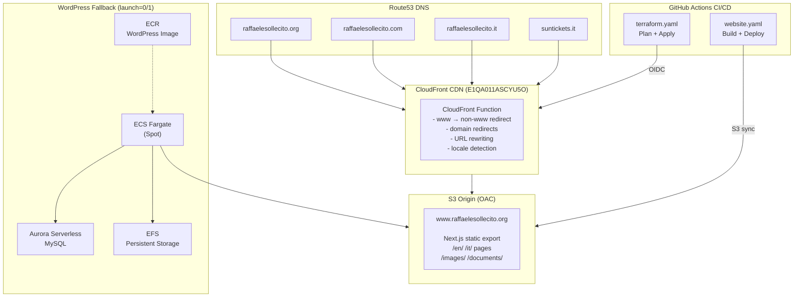

# Architecture

## High-Level Overview

## Components

### CloudFront Distribution

- **Distribution ID**: E1QA011ASCYU5O
- **Domain**: d34mbna360z1v.cloudfront.net
- **Aliases**: raffaelesollecito.org, www.raffaelesollecito.org, .com, .it, suntickets.it (8 total)
- **SSL**: ACM certificate with SANs for all 8 domains
- **HTTP/3**: Enabled
- **Cache Policy**: Managed-CachingOptimized
- **Origin Access**: OAC (Origin Access Control) — no public bucket access

### CloudFront Function (`url-rewrite.js`)

Single viewer-request function handling all edge logic:

1. **www → non-www**: `www.raffaelesollecito.org` → 301 to `raffaelesollecito.org`
2. **Domain redirects**: `.com` and `.it` variants → 301 to `raffaelesollecito.org`
3. **SunTickets locale**: `suntickets.it` → 301 to `/en/archive/` or `/it/archive/` based on `Accept-Language`
4. **URL rewriting**: Appends `index.html` for directory requests and extensionless paths

### S3 Buckets

| Bucket | Purpose | Managed By |
|--------|---------|------------|
| `www.raffaelesollecito.org` | Production static site | Terraform + GitHub Actions |
| `staging.raffaelesollecito.org` | Staging preview | Manual CLI |
| `terraform-wordpress-states` | Terraform state backend | Manual |
| `raffaelesollecitowebsite-build` | CodeBuild artifacts | Terraform |

### ACM Certificate

- **Region**: us-east-1 (required for CloudFront)
- **Primary domain**: raffaelesollecito.org
- **SANs**: www.raffaelesollecito.org, raffaelesollecito.com, www.raffaelesollecito.com, raffaelesollecito.it, www.raffaelesollecito.it, suntickets.it, www.suntickets.it
- **Validation**: DNS (Route53 records per hosted zone)

### Route53 Hosted Zones

| Zone | Domain | Records |
|------|--------|---------|
| Z10348702D3SPFDJMEVEN | raffaelesollecito.org | A alias → CloudFront, www CNAME, ACM validation |
| Z00061822XXU0URGO4KDL | raffaelesollecito.com | A alias → CloudFront, www A alias → CloudFront, ACM validation |
| Z00582702KHBK8CRMY8OK | raffaelesollecito.it | A alias → CloudFront, www A alias → CloudFront, ACM validation |
| Z05555093JQD0GMO8XCAN | suntickets.it | A alias → CloudFront, www A alias → CloudFront, ACM validation |

### WordPress Fallback (ECS)

The legacy WordPress CMS is preserved as a fallback:

- **ECS Cluster**: `raffaelesollecitowebsite_wordpress`
- **Task**: Fargate Spot, 256 CPU / 512 MB
- **Database**: Aurora Serverless MySQL
- **Storage**: EFS for persistent WordPress files
- **Container Image**: ECR repository (custom WordPress + WP2Static)
- **Toggle**: `launch` variable (0=off, 1=on)

When `launch=1`, WordPress runs at `http://wordpress.raffaelesollecito.org` and can publish static content to the same S3 bucket via WP2Static.

## Staging Environment

- **S3 Bucket**: staging.raffaelesollecito.org
- **CloudFront**: E1JC5ON7Q19C1J (d2k2zztrnaobxr.cloudfront.net)
- **CloudFront Function**: staging-index-rewrite (separate from production)
- **Not Terraform-managed** — created manually for preview purposes

## Security

- No public S3 bucket access — CloudFront OAC only
- HTTPS enforced (viewer-protocol-policy: redirect-to-https)
- TLS 1.2+ minimum (TLSv1.2_2021, supports TLS 1.3)
- GitHub Actions OIDC — no static AWS credentials
- WAFv2 available but currently disabled (`waf_enabled=false`)
