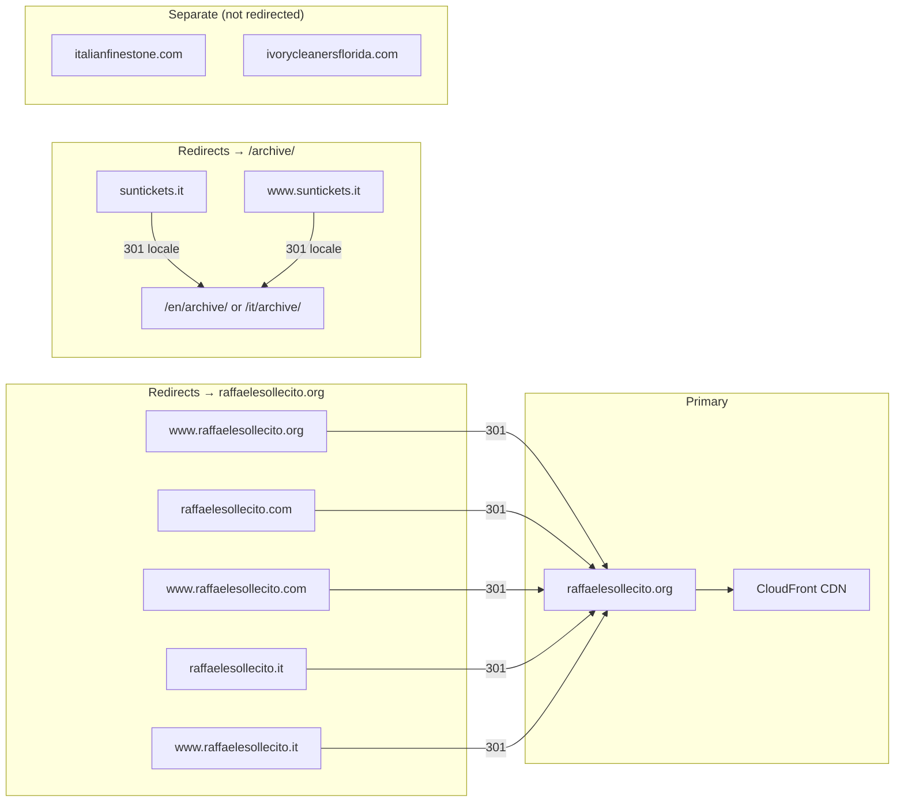
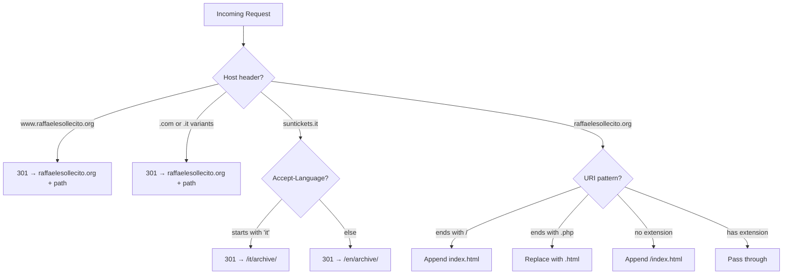

# Domain Management

## Domain Inventory



## Route53 Hosted Zones

| Domain | Zone ID | Records | Purpose |
|--------|---------|---------|---------|
| raffaelesollecito.org | Z10348702D3SPFDJMEVEN | A alias, www CNAME, ACM CNAME | Primary site |
| raffaelesollecito.com | Z00061822XXU0URGO4KDL | A alias, www A alias, ACM CNAME | Redirect to .org |
| raffaelesollecito.it | Z00582702KHBK8CRMY8OK | A alias, www A alias, ACM CNAME | Redirect to .org |
| suntickets.it | Z05555093JQD0GMO8XCAN | A alias, www A alias, ACM CNAME | Redirect to /archive/ |
| italianfinestone.com | Z02731132IAQ61MXV0IF | Various | Separate site |
| ivorycleanersflorida.com | Z07197043QJJL2YKDTJN8 | Various | Separate site |

## ACM Certificate

Single certificate covering all domains:

- `raffaelesollecito.org` (primary)
- `www.raffaelesollecito.org`
- `raffaelesollecito.com` + `www`
- `raffaelesollecito.it` + `www`
- `suntickets.it` + `www`

Managed in Terraform (`acm.tf`). DNS validation records are created in each domain's hosted zone automatically.

## Redirect Logic

All redirects are handled at the CloudFront edge by a single CloudFront Function (`modules/cloudfront/functions/url-rewrite.js`):



## SEO Considerations

- **Canonical domain**: `raffaelesollecito.org` (no www)
- All alternate domains return **301 Moved Permanently** (permanent redirect)
- Google consolidates link equity to the canonical domain
- `sitemap.xml` and `robots.txt` reference only `raffaelesollecito.org`
- `hreflang` alternates in sitemap for EN/IT language versions

## Adding a New Redirect Domain

1. Register the domain and create a Route53 hosted zone
2. Add to `redirect_domains` in `local.tfvars` / GitHub Variables:
   ```hcl
   "newdomain.com" = {
     zone_id     = "Z_NEW_ZONE_ID"
     redirect_to = "https://raffaelesollecito.org"
   }
   ```
3. Add `"newdomain.com"` and `"www.newdomain.com"` to `cloudfront_aliases`
4. Add the domain to the `REDIRECT_MAP` in `url-rewrite.js`
5. Run Terraform apply — creates ACM SANs, DNS validation, Route53 records
